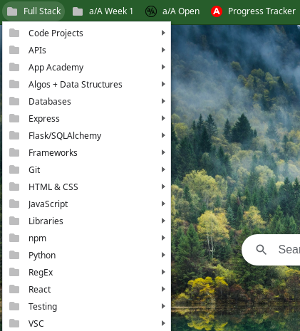

# DON'T PANIC

## A Guidebook for Attention Management During Code Bootcamp

(Introductory paragraph)
___

### "Cameras On!"

#### How not to space out during lectures and Q & A

- DESK SENSORY/AESTHETICS - Think outside the fidget spinners and bobbleheads! Polished rocks, doodle pads and gel pens, prisms, candles, "thinking putty" and "sensory stickers" are all examples of things that can provide immediate passive distraction to help you stay focused.
- TAKE NOTES - Always have a pen/notebook ready. During lectures, instructors often blurt out useful commands, terminal flags, VScode extensions and other tips outside the scope of a/A material.
  - If your attention span is sus and the subject especially hard, this note-taking strategy might help: Create an outline over a few notebook pages based on LOs/Homework and leave lots of room inbetween for taking notes during lecture. Your instructors will clearly emphasize important concepts. Stay engaged and help those concepts sink in by writing down what resonates with you.
  - Make it Spicy! Use different pen/highlighter colors to distinguish parts of your notes.
  - Not big on written notes? Set up a system for typing notes into .md, .txt, and/or language-based files for each week.
  - Be flexible - sometimes you'll be coding along or it won't make sense to take notes. That's ok! Think of your notes as part of your toolbox, not a single source of truth.
- SCREENSHOTS - Best used sparingly. Most code demos will be shared, but at least know the OS SS command and what folder the images are saved to in case you need to capture something quickly

___

### Screen Real Estate

#### Designing your Dev Environment for maximum productivity and enjoyment

- A DESKTOP THAT SLAPS - Your mileage may vary, but for most a/A students: Zoom, Slack, Chrome, VScode, and terminal windows are often running simultaneously. It's worthwhile to learn how to configure your OS desktop for quick navigation. Simple keystrokes and gestures can quickly split applications across the screen and invoke multiple desktops.
- THEMED MACHINE - All applications mentioned have worlds of themes to explore that install in a snap. Have fun with that!
- BROWSER BOOKMARKS - Keep yourself from getting lost in "Tab Town" with a system for bookmarks during a/A. It can be helpful to have one folder with sub-folders of categories and another at-your-fingertips folder for current endeavors where urls can be sorted into the categories or removed if no longer needed.  

___

### Tree of Code

#### Build routines around directory structures

- Here's App Academy's recomended file structure. Create all the needed folders at once, or make it part of your routine to add new weeks systematically. A messy file system in coding is way worse than a messy desk!:

- `app_academy` (**folder**)
  - `Module-1-Resources` (**folder**)
  - `week_1` (**folder**)
    - `w1d1` (**folder**)
      - `lecture`(**folder**)
        - `README.md`
        - ...
      - `projects` (**folder**)
        - `file1.js` (**file**)
        - `file2.js` (**file**)
        - ...
      - `homework` (**folder**)
        - `file1.js` (**file**)
        - `file2.js` (**file**)
        - ..

___

### Homework Helpers

#### Non-traditional ideas for fitting it all in

- Install a "text-to-speech" extension on Chrome(ReadMe, NaturalReader, etc). Code blocks will sound a little weird, but many students find these extensions helpful when they simply can't focus on reading silently.
- Install "DarkMode" Chrome extension to help with eye strain. On your phone/tablet, look for a "Dark Browser" to read homework on a/A open comfortably anytime anywhere. That said...
- CODE ALONG! We can't stress this enough. Seek out any parts of your homework that take you through a coding process and prioritize your homework strategy accordingly so you're not skipping over it.

___

### The Winter of your Disco Tent

#### Some alternative audio/ambience ideas to looping over your favorite playlists and palatable study music genres while you code

- Best of ASMR Ambience YouTube Playlist: <https://www.youtube.com/playlist?list=PLbHKQRU4EeQY3YKtOMMmVtkIOadBSXbzD>
- Flow Coding YouTube Playlist: <https://youtube.com/playlist?list=PLbHKQRU4EeQain9SvySK83azPxbOItY__>
